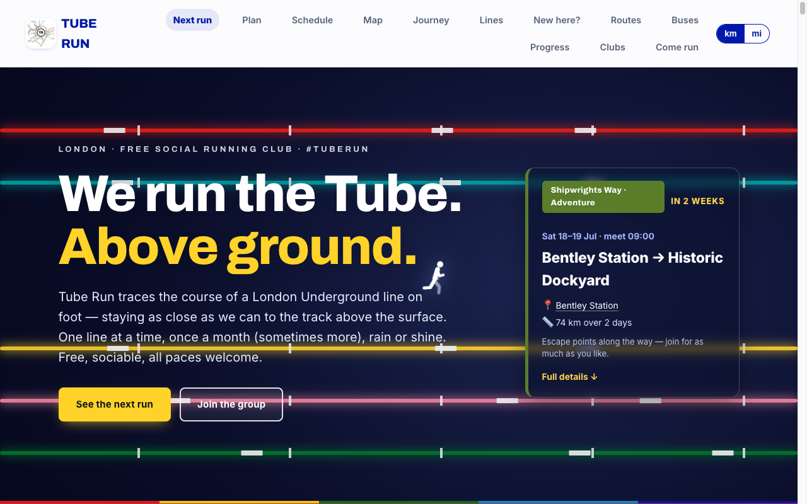
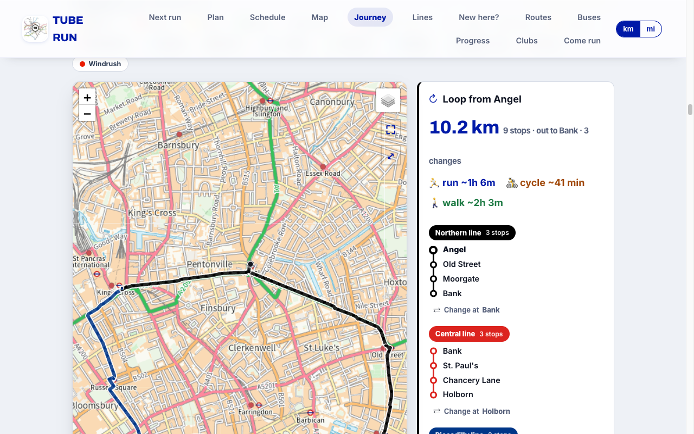
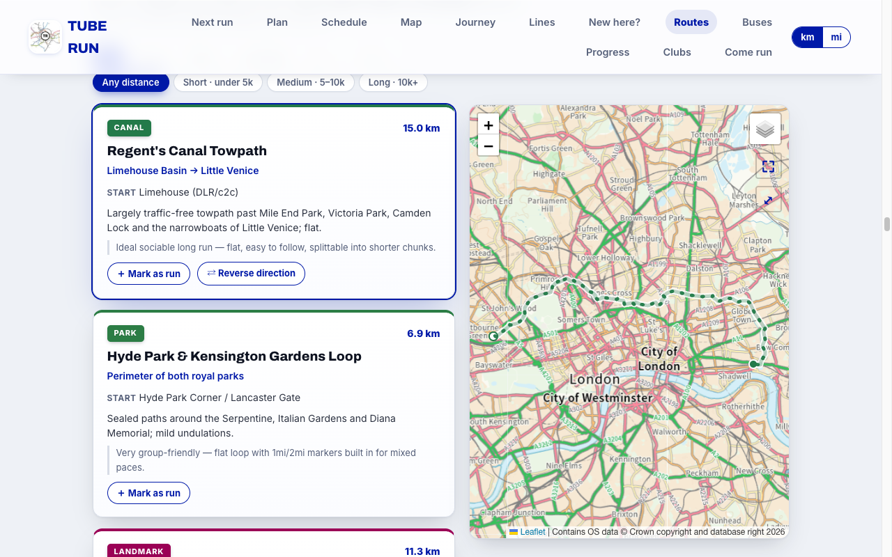

# Overland

**▶ Live site: [psurma.github.io/Overland](https://psurma.github.io/Overland/)**

Website for **London Overland** — a free, social running club that runs London's transport network above ground: Underground, Overground and Elizabeth lines once a month (sometimes more), plus the National Rail commuter lines, bus routes, and river/canal, park, landmark and out-of-town adventure routes.

Plain HTML/CSS/JS. No build step.

## Screenshots

| Home | Journey &amp; loop planner |
| --- | --- |
| [](https://psurma.github.io/Overland/) | [](https://psurma.github.io/Overland/#journey) |

[](https://psurma.github.io/Overland/#routes)

*Route library — tap a card to trace a route on the interactive map (Regent's Canal shown).*

## Run locally

```
python3 -m http.server 8000
```

Then open http://localhost:8000 (opening `index.html` via `file://` is blocked by the browser).

## Features

- **Next run** card with live weather (Open-Meteo) and a Google Maps meeting-point link
- **Plan** — station-to-station distance/time planner with run + walk times and a km/miles toggle
- **Map** — tabbed viewer led by our own real geographic Leaflet map (next line lit up with running times), plus Running times, Walking times, Toilets, official Tube map, Overground and Rail connections
- **Lines** — every line ranked by length with run/walk times: Underground, Overground, Elizabeth and the ten National Rail commuter operators
- **Schedule** — monthly runs, auto-dated to first Sundays, plus multi-day adventures
- **Route ideas** — a library of group-friendly London routes, each traced on an interactive Leaflet map (tap a card to draw its route)
- **Line collector** — gamified progress (both directions of every line)
- Live-now banner, photo gallery, new-runner guide, friends/other clubs, join form, socials

## Editing

Everything data-driven lives at the top of `script.js`:

- `CONNECT` — social links
- `RUN_PLAN` — the monthly schedule (tube / river / canal / bus / adventure)
- `WAYPOINTS` — ordered stations (with coords) for the planner + running-times
- `LINE_DIRS` — line-collector progress
- `LIVE` — live-now banner (flip `active` on run day, paste Garmin/Strava links)
- `ROUTES` — the route-ideas library
- `GALLERY` — photos

The `?v=` cache-buster on the `style.css` / `script.js` links in `index.html` is bumped automatically by the pre-commit hook whenever a commit touches the files it references — no hand-editing needed. The hook also syntax-checks `script.js`, regenerates `data/schedule.json` and runs `tools/validate-data.mjs` over the derived data. It lives tracked at `tools/pre-commit`; install it after a fresh clone with:

```
cp tools/pre-commit .git/hooks/pre-commit && chmod +x .git/hooks/pre-commit
```

## Maps

The map viewer (`#network`) has several tabs:

- **Map** — *our own* real geographic map: a [Leaflet](https://leafletjs.com) slippy map on the openly-licensed CARTO Voyager basemap (streets, parks, the Thames, place names), with every tube line drawn over real geography from `data/tube-lines.geojson`. The next run's line is lit up with cumulative running (or walking) times at each stop; other lines dim back. Interchanges show as white rings, toilets as teal WC pins. Scroll to zoom, drag to pan, hover a station.
- **Tube map** — the official TfL schematic (vector SVG) with the next line highlighted. TfL artwork, © Transport for London.
- **Running / Walking times, Toilets, Overground, Rail connections** — computed table and reference images.

### Data & attribution

- `data/tube-network.json` — 18 TfL lines / 425 stations with real coordinates, compiled from the [TfL Unified API](https://api.tfl.gov.uk) (open data). Drives station markers, interchange detection and running-time calculations.
- `data/nr-network.json` + `data/nr-lines.geojson` — the ten National Rail commuter operators (stations, branches and track geometry, clipped to the commuter belt), also from the TfL Unified API via `tools/generate-nr-lines.mjs`. Together the site covers 28 lines / ~1,000 stations, out to Portsmouth, Southend and Luton.
- `data/tube-lines.geojson` — real track geometry for the 18 TfL lines (`MultiLineString` per line), drawn as the coloured line overlay on the Leaflet map.
- `data/station-toilets.json` — stations with confirmed toilets, from TfL StopPoint facility data.
- `data/boroughs.json` — station/route → London borough tagging for the Borough bagger, from [ONS Open Geography](https://geoportal.statistics.gov.uk/) boundaries (OGL) via `tools/generate-boroughs.mjs`.
- `data/route-pubs.json` — well-rated pubs near each curated route's ends, from the [Food Standards Agency API](https://ratings.food.gov.uk) (open data) via `tools/generate-pubs.mjs`.
- Basemap tiles © [OpenStreetMap](https://www.openstreetmap.org/copyright) contributors, © [CARTO](https://carto.com/attributions); Leaflet is BSD-2-licensed.
- `data/schematic.json` — Beck-style schematic coordinates (seeded from [`d3-tube-map`](https://github.com/johnwalley/d3-tube-map) by John Walley, **MIT licence**); retained for reference, not currently shown.

Static image maps in `img/` were converted from PDFs with `pdftocairo`. TfL map artwork is © Transport for London — fine for club use, but a public deployment should prefer the openly-licensed / own-drawn maps above.
